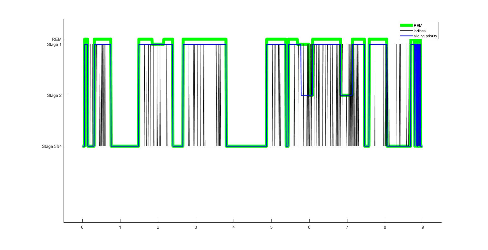
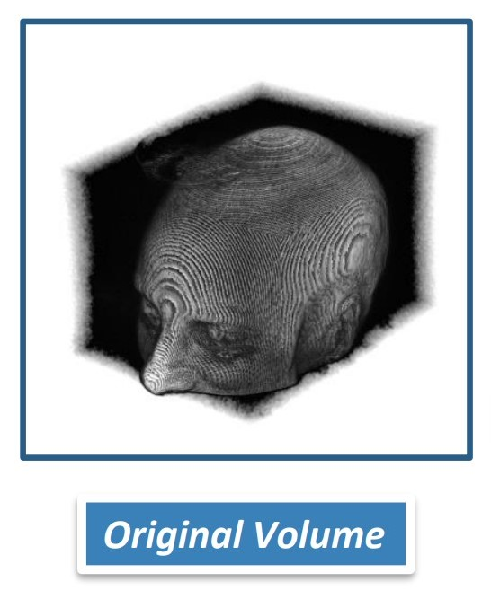
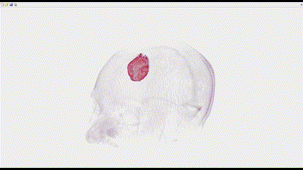
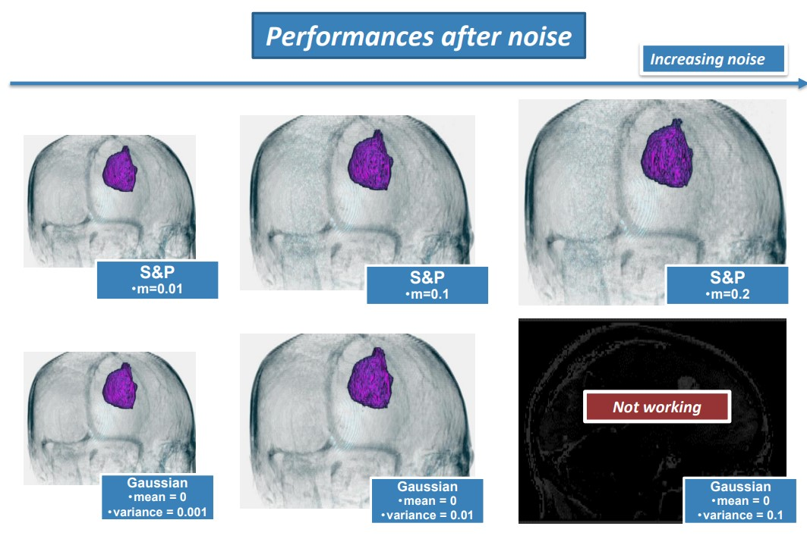

<!-- Header -->

<p align="center">
    
</p>


--------------

# ⚠️ Disclaimer ⚠️
This readme file is still under construction.
Please come back later (3-4 days).

# CaVe: Castellani - Vettori

## Scope: 
These projects were developed as part of the course of [Biomedical Signal Processing & Medical Images](https://www11.ceda.polimi.it/schedaincarico/schedaincarico/controller/scheda_pubblica/SchedaPublic.do?&evn_default=evento&c_classe=766825&polij_device_category=DESKTOP&__pj0=0&__pj1=4b2fa48767f0da38e5c6eff2bf408a34), held by Prof. M. Signorini.
During the span of the course, processing and elaboration techniques for biomedical signals and medical images were studied.

## What is it ?
Two projects realized by a team of students from Politecnico di Milano.

##### Authors: Filippo Castellani, Gaia Vettori


## What does it do ?

These projects deal with two very different topics:
 1. Hypnogram estimation from EEG signals during sleep.
 2. Quasi-Automatic Segmentation of lesions in brain MRI images.

During the course of the project, the **aim** was to **develop algorithms** that could sove the tasks **and critically evaluate the obtained results**.
In order to do so a starting bibliography on the state of the art in the task-related field was given in order to kickstart the research.
Consequently, the studied algorithms were implemented in Matlab and tested on real data furnished by the professor.

## Repository structure:

```bash

CaVe
├── Project1
│   ├── Bibliography
│   ├── Versions_(Backups)
|
├── Project2
    ├── Dataset_&_Bibliography
    ├── Versions_(Backups)
    
```

# Brief description of the projects:

## Project 1: Hypnogram estimation from EEG signals during sleep.

**Dataset:**

    - 1         = number of subjects
    - 8 hours   = EEG recording length
    - 512 Hz    = sampling frequency
    - FP1       = electrode position (frontal lobe)


**Purpose:**
- To characterize the sleep stages of the patient (NREM 1/2/3/4 and REM)

**Method:**

- Pre-processing of the signal (band-pass filtering [0.1-90 Hz] + 50 Hz Electric Noise removal)
 - ...
<!-- - Through the estimation of the power spectral density of epochs of 3 minutes that is done with the modified Bartlett periodogram which uses a Hann/Hamming window of 30 seconds.
        ◦ 
    • For each obtained PSD (Power Spectral Density) Γ(f) the following procedure is performed:
        ◦ 
        ◦ -->

**Results:**

<p align="center">
    
    <br>
    <i> Click on the image to see the full size version </i>
</p>

## Project 2: Quasi-Automatic Segmentation of lesions in brain MRI images.

> **Q: Why is it called Quasi-Automatic Segmentation ?**
> 
> **A:** Quasi-Automatic means that the user has to manually select the region of interest (ROI) in the first slice of the MRI image, and then the algorithm will automatically segment the lesion in the other slices of the image.

**Dataset:**

    - 1                         = number of subjects
    - 256x256x112 voxels        = MRI volume size
    - 0.9375, 0.9375, 1.4000    = voxel size (mm)
    - T1-weighted               = MRI type

<p align="center">
    
    <br>
    <i> Click on the image to see the full size version </i>
</p>

**Purpose:**
- Segment the lesion and calculate the respective cross-sectional area over sagittal slice number 135.
- Identify sagittal slices that contain the lesion and extend the quantification of its cross-sectional area to the whole volume.
- Repeat this process across axial slices.
- Add noise to the original dataset and check the performances of your implemented workflow with respect to different levels of noise.

**Method:**


The following method is graphically represented in the following document: [here](Project2/MEDICAL_IMAGES_ASSIGNMENT_Vettori_Castellani/ppt_presentation.pdf).

The method developed is based on the following main steps:
1. The very first slice of the MRI volume is selected by the field expert (FE) (presumably a radiologist) as well as the region of interest (ROI) in the first slice.
2. The selected ROI is enhanced by the algorithm using a non-linear filter.
    This filter was one of the main contributions of the project since it was developed by the team. See the [Non-linear filter](#non-linear-filter) section for more details.
3. The enhanced ROI is then binarized using one of the most common binarization techniques: Otsu's method.
4. The binarized ROI is then proposed to the FE for approval. If the FE approves the binarization, the algorithm proceeds to the next step, otherwise the FE can manually modify the binarization.
5. The algorithm then proceeds automatically to the segmentation of the lesion in the other slices of the MRI.
This is achieved by repeating steps 2-4 for each slice of the MRI volume and selecting the binarized area that has the closest overlap with the centroid of the binarized area of the previous slice.

NOTICE: In order not to "lose" the lesion in case of a wrong binarization, the algorithm keeps track of the previous binarizations and uses the centroids as a reference for the next slice by weighting them with a [recursive factor](#recursive-weighting-factor).

**Results:**

<p align="center">
    
    <br>
    <i> Click on the image to see the full size version </i>
</p>

The algorithm was tested on the provided dataset and tested against different levels of noise.
It was found that the algorithm is robust against different levels and types of noise (Gaussian, Salt & Pepper) and that the results are very promising. However this is not enough to validate the algorithm and further testing is required, see [main limitations of the project](#main-limitations-of-the-project).

<p align="center">
    
    <br>
    <i> Click on the image to see the full size version </i>
</p>


## Main limitations of the project:

Due to time constraints, the algorithm was not tested on a validation dataset. This is a very important step in order to evaluate the robustness of the algorithm and to tune the parameters of the algorithm. However, the algorithm proved to be robust against different levels of noise so the results are promising and the algorithm could probably proceed to the next step of validation.

## Additional information:

#### Non-linear filter:

This filter is a modified version of the sigmoid function. This function is used to enhance the contrast of the image in order to make the lesion more visible.

$$
    Def:
    \begin{cases}
        I(x,y) = \text{Original image} \\
        \hat{I}(x,y) = \text{Enhanced image} \\
    \end{cases}  
$$

The filter is based on the following operation:

$$
    \begin{equation}
    \hat{I}(x,y) = \frac{1+g}{1+e^{k\frac{1}{2}-kI(x,y)}}-\frac{g}{2}
    \end{equation}
$$

$$
where:
\begin{cases}
        g = \text{gain} \\
        k = \text{constant} \\
    \end{cases}
$$

<!--
TODO: Add image of the filter
-->

#### Recursive weighting factor:

The recursive weighting factor is used to weight the centroids of the binarized areas of the previous slices in order to find the centroid of the binarized area of the current slice.

$$
\begin{equation}
 weight_n = \frac{1}{1.2^n}
\end{equation}
$$


--------------------------------------------------------------------------------------------------

## What software is required to run the projects scripts ?
 - **Matlab R2020b** was used for the development of the projects. So at least this version is recommended to run the scripts.


