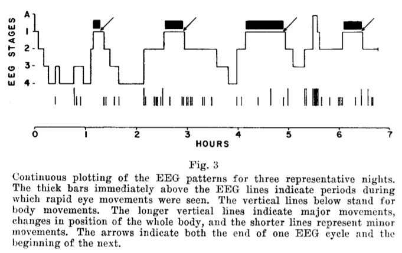
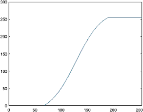
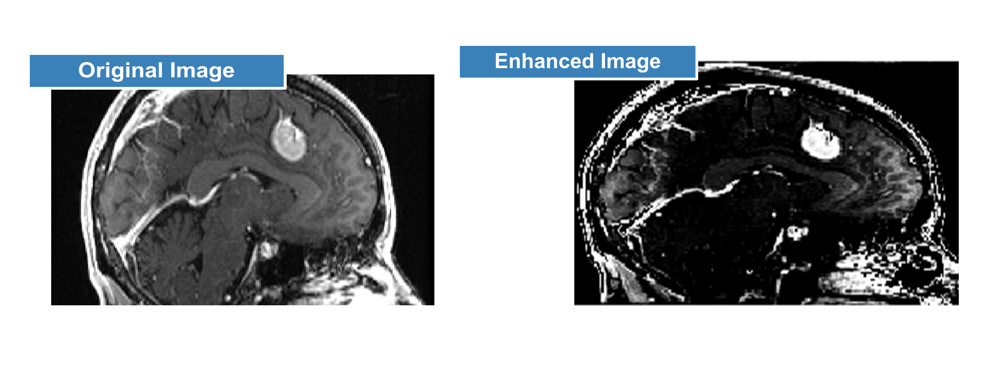
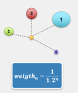

<!-- Header -->

<p align="center">
    
</p>


--------------

# CaVe: Castellani - Vettori

## Scope: 
These projects were developed as part of the course of [Biomedical Signal Processing & Medical Images](https://www11.ceda.polimi.it/schedaincarico/schedaincarico/controller/scheda_pubblica/SchedaPublic.do?&evn_default=evento&c_classe=766825&polij_device_category=DESKTOP&__pj0=0&__pj1=4b2fa48767f0da38e5c6eff2bf408a34), held by Prof. M. Signorini.
During the span of the course, processing and elaboration techniques for biomedical signals and medical images were studied.

## What is it ?
Two projects realized by a team of students from Politecnico di Milano.

##### Authors: Filippo Castellani, Gaia Vettori

## What does it do ?

These projects deal with two very different topics:
 1. Hypnogram estimation from EEG signals during sleep.
 2. Quasi-Automatic Segmentation of lesions in brain MRI images.

During the course of the project, the **aim** was to **develop algorithms** that could solve the tasks and **critically evaluate** the obtained results.
In order to do so, a starting bibliography on the state of the art in the task-related field was given to kickstart the research.
Consequently, the studied algorithms were implemented in Matlab and tested on real data furnished by the professor.

## Repository structure:

```bash

CaVe
├── Project1
│   ├── Bibliography                                                # Bibliography on the state of the art
│   ├── Versions_(Backups)                                          # Backups of the project
|   ├── BIOMEDICAL_SIGNAL_PROCESSING_ASSIGNMENT_Castellani_Vettori  # Final version of the project
|   |   ├── ppt_EEG_Hypnogram_Vettori_Castellani_FINAL.pdf          # Final presentation
|   |   ├── Project Report.pdf                                      # Final report
|   |   ├── Matlab_Scripts                                          # Matlab scripts and functions
|   |   └── ...
|   └── ...
|
└── Project2
    ├── Dataset_and_Bibliography                                    # Dataset and bibliography on the state of the art
    ├── Versions_(Backups)                                          # Backups of the project
    ├── MEDICAL_IMAGES_ASSIGNMENT_Vettori_Castellani                # Final version of the project
    |   ├── ppt_presentation.pdf                                    # Final presentation
    |   ├── Project Report.pdf                                      # Final report
    |   ├── Matlab_Scripts                                          # Matlab scripts and functions
    └── ...

    
```

## Main limitations of the projects:

Due to the absence of ground truth data and time constraints, the algorithms were not tested on a validation dataset. This is a very important step in order to evaluate the robustness of any algorithm and to tune the parameters of the algorithm. 

However, the algorithm developed for [Project 2](#project-2-quasi-automatic-segmentation-of-lesions-in-brain-mri-images) was tested against different levels of noise and proved to be robust against different types of noise (Gaussian, Salt & Pepper) at different intensities.These results are highly promising, indicating the algorithm's readiness for the next stage of validation.

# Brief description of the projects:

## Project 1: Hypnogram estimation from EEG signals during sleep.

**Dataset:**

    - 1         = number of subjects
    - 8 hours   = EEG recording length
    - 512 Hz    = sampling frequency
    - FP1       = electrode position (frontal lobe)


**Purpose:**
Characterize the sleep stages of the patient ( NREM 1 - 2 - 3/4 and REM )

**Method:**

> The developed method is presented [here](Project1/BIOMEDICAL_SIGNAL_PROCESSING_ASSIGNMENT_Castellani_Vettori/ppt_EEG_Hypnogram_Vettori_Castellani_FINAL.pdf).

- Pre-processing of the signal (band-pass filtering [0.1-90 Hz] + 50 Hz Electric Noise removal)
- Non-parametric spectral estimation (Welch's modified periodogram)
    - The epochs are 3 minutes long and an Hann/Hamming window of 30 seconds is used along with a 50% overlap between consecutive epochs. This is done in order to reduce the variance of the PSD estimate.
- Sleep stage classification based on Power In Band (PIB) estimation.
    - The PIB is estimated by integrating the PSD in the respective band: δ (0.5-4 Hz) / θ (4-8 Hz) / α (8-12 Hz) / β (12-30 Hz) / γ (30-50 Hz)
    - The classification algorithm utilized is known as "Priority Assignment," a name derived from its distinctive approach of assigning priority to infrequent yet pivotal events that still occur often enough to surpass a predefined "occurrence threshold."


**Results:**

The algorithm produced results that closely resembled those obtained using state-of-the-art techniques.
Hypnogram obtained by the algorithm. Unfortunately, this was not tested on a validation dataset, see [main limitations of the projects](#main-limitations-of-the-projects).


<p align="center">
    
    <br>
    <i> Click on the image to see the full size version </i>
</p>

Hypnogram example obtained by the state of the art technique:

<p align="center">
    
    <br>
    <i> Click on the image to see the full size version </i>
</p>

The most valuable addition of such an algorithm is that it is completely automatic and does not require any manual intervention. Currently, the state of the art techniques require the Field Expert (FE) to manually inspect many hours of EEG recordings and manually annotate the sleep stages. This is a very time-consuming task and is prone to human error.


## Project 2: Quasi-Automatic Segmentation of lesions in brain MRI images.

> **Q: Why is it called Quasi-Automatic Segmentation ?**
> 
> **A:** "Quasi-Automatic" refers to the approach where the user initiates the segmentation process by manually selecting the region of interest (ROI) in the first slice of the MRI image. Subsequently, the algorithm takes over and automatically performs lesion segmentation in the remaining slices of the image. This hybrid method streamlines the segmentation process while still requiring an initial user interaction to define the area of interest.

**Dataset:**

    - 1                         = number of subjects
    - 256x256x112 voxels        = MRI volume size
    - 0.9375, 0.9375, 1.4000    = voxel size (mm)
    - T1-weighted               = MRI type

<p align="center">
    
    <br>
    <i> Click on the image to see the full size version </i>
</p>

**Purpose:**

- The primary objective of this project is to segment the lesion and calculate its cross-sectional area specifically in the sagittal slice number 135;
- Following the initial segmentation, the secondary goal is to identify sagittal slices containing the lesion and extend the quantification of its cross-sectional area to the entire volume of interest;
- This segmentation process is then repeated across axial slices, enabling a comprehensive assessment of the lesion's extent and characteristics;
- As a part of the project's evaluation, noise is intentionally introduced into the original dataset. The objective is to systematically investigate the performance of the implemented workflow under various levels of noise, providing valuable insights into its robustness and reliability.

**Method:**

> The developed method is presented [here](Project2/MEDICAL_IMAGES_ASSIGNMENT_Vettori_Castellani/ppt_presentation.pdf).

The method developed is based on the following main steps:
1. The very first slice of the MRI volume is selected by the Field Expert (FE) (presumably a radiologist) as well as the region of interest (ROI) in the first slice;
2. The selected ROI is enhanced by the algorithm using a non-linear filter;
    This filter was one of the main contributions of the project since it was developed by the team. See the [Non-linear filter](#non-linear-filter) section for more details;
3. The enhanced ROI is then binarized using one of the most common binarization techniques: Otsu's method.
4. The binarized ROI is then proposed to the FE for approval. If the FE approves the binarization, the algorithm proceeds to the next step, otherwise the FE can manually modify the binarization;
5. The algorithm then proceeds automatically to the segmentation of the lesion in the other slices of the MRI.
This is achieved by repeating steps 2-4 for each slice of the MRI volume and selecting the binarized area that has the closest overlap with the centroid of the binarized area of the previous slice;

NOTICE: In order not to "lose" the lesion in case of a wrong binarization, the algorithm keeps track of the previous binarizations and uses the centroids as a reference for the next slice by weighting them with a [recursive factor](#recursive-weighting-factor).

**Results:**

<p align="center">
    
    <br>
    <i> Click on the image to see the full size version </i>
</p>

The algorithm was tested on the provided dataset and tested against different levels of noise.
It was found that the algorithm is robust against different levels and types of noise (Gaussian, Salt & Pepper) and that the results are very promising. However this is not enough to validate the algorithm and further testing is required, see [main limitations of the project](#main-limitations-of-the-project).

<p align="center">
    
    <br>
    <i> Click on the image to see the full size version </i>
</p>


## Additional information:

#### Non-linear filter:

This filter is a modified version of the sigmoid function. This function is used to enhance the contrast of the image in order to make the lesion more "visible" and hence easier to segment for the algorithm.

$$
    Def:
    \begin{cases}
        I(x,y) = \text{Original image} \\
        \hat{I}(x,y) = \text{Enhanced image} \\
    \end{cases}  
$$

The filter is based on the following operation:

$$
    \begin{equation}
    \hat{I}(x,y) = \frac{1+g}{1+e^{k\frac{1}{2}-kI(x,y)}}-\frac{g}{2}
    \end{equation}
$$

$$
where:
\begin{cases}
        g = \text{gain} \\
        k = \text{constant} \\
    \end{cases}
$$

Furthermore, the function is clipped to the range [0,255] in order to avoid overflow and underflow:

$$

    \begin{cases}
        \hat{I}(x,y) = 255 \text{ if } \hat{I}(x,y) > 255 \\
        \hat{I}(x,y) = 0 \text{ if } \hat{I}(x,y) < 0 \\
    \end{cases}
$$

<p align="center">
    
    <br>
    Figure: Non-linear filter with parameters g = 0.2 and k = 10
</p>

Example of the filter applied to the original image:

<p align="center">
    
    <br>
    <i> Click on the image to see the full size version </i>
</p>


#### Recursive weighting factor:

The recursive weighting factor is used to weight the centroids of the binarized areas of the previous slices in order to find the centroid of the binarized area of the current slice.

$$
\begin{equation}
 weight_n = \frac{1}{1.2^n}
\end{equation}
$$

The following is an intuitive representation of the recursive weighting factor:

<p align="center">
    
    <br>
</p>

--------------------------------------------------------------------------------------------------

## What software is required to run the projects scripts ?
 - **Matlab R2020b** was used for the development of the projects. So at least this version is recommended to run the scripts.


